# 基本設計書 — AI-Native Engineering Platform

> **AI-Native Engineering Platform — Basic Design Document (基本設計書)**
>
> **準拠フレームワーク / Framework Compliance:** IPA 共通フレーム 2013 (SEC BOOKS) — 「システム方式設計」プロセス成果物。IPA/SEC『非機能要求グレード (2018 改訂版)』の 6 大項目分類と、Phase 14 で実施した IPA 標準ギャップ分析 (F14-1〜F14-9) の Accepted-and-fixed 反映を含む。
>
> **ステータス / Status:** v1.0 draft. 入力は `docs/requirements/00-requirements-definition.md` (Baseline v1.0)、`phase6-primitives.md`、`phase9-mvp-reduction.md`、`phase10-architecture.md`、`phase14-ipa-compliance-review.md` の Phase 14 補完反映。
>
> **想定読者 / Audience:** 内部アーキテクト／実装エンジニア／将来の外部受託レビュー担当。実装者・運用者・セキュリティ監査者の三者を同時に対象とする。
>
> **タグ規約 / Tagging convention (inherited):**
> - `[FACT]` — 一次ソースで検証済みの事実
> - `[UNVERIFIED-FACT]` — 複数二次ソースで裏取り済みだが本セッションで一次未取得
> - `[INFERENCE]` — 既知事実からの妥当な推論
> - `[PROPOSAL]` — 本プロジェクトの設計主張（外部出典を引用しない）
> - `[TBD]` — 未確定（後続フェーズ／決定待ち）

---

## 目次 / Table of Contents

1. [はじめに / Introduction](#1-はじめに--introduction)
2. [システム概要 / System Overview](#2-システム概要--system-overview)
3. [システム方式設計 / System Architecture Design](#3-システム方式設計--system-architecture-design)
4. [機能設計 / Functional Design](#4-機能設計--functional-design)
5. [データ設計 / Data Design](#5-データ設計--data-design)
6. [インターフェース設計 / Interface Design](#6-インターフェース設計--interface-design)
7. [非機能設計 / Non-Functional Design](#7-非機能設計--non-functional-design)
8. [セキュリティ設計 / Security Design](#8-セキュリティ設計--security-design)
9. [運用・保守設計 / Operations & Maintenance Design](#9-運用保守設計--operations--maintenance-design)
10. [移行設計 / Migration Design (Local → Cloud)](#10-移行設計--migration-design-local--cloud)
11. [受入テスト方針 / Acceptance Test Policy](#11-受入テスト方針--acceptance-test-policy)
12. [Appendix — 設計根拠のトレーサビリティ](#appendix--設計根拠のトレーサビリティ)
13. [Appendix — 残 TBD 項目一覧 (本設計書で未確定)](#appendix--残-tbd-項目一覧-本設計書で未確定)

---

## 1. はじめに / Introduction

### 1.1 目的 / Purpose

本文書は、AI-Native Engineering Platform（以降「本プラットフォーム」または「Platform」）の **基本設計（外部設計）** を定義する。基本設計は、要件定義書（`docs/requirements/00-requirements-definition.md`）で合意した内容を、**実装着手前に決定しておく必要がある方式・機能・データ・インターフェース・非機能・運用・セキュリティ** の各設計判断として確定する責務を持つ。詳細設計（内部設計）のインプットとなる。

本書の位置付けは IPA 共通フレーム 2013 の「システム方式設計プロセス」成果物に対応し、要件定義書 → 基本設計書 → 詳細設計書 → 実装・単体テスト → 結合テスト → 受入テスト という流れの上流側成果物である。

### 1.2 スコープ / Scope

**含む (In scope for this design document):**

- 本プラットフォーム MVP スコープ（Phase 9 で確定した 37 要件）と、それと直接連動する V1 隣接要件のうち方式設計レベルで確定が必要なもの
- デプロイ形態（Local-First / Cloud-Ready）の双方に対する方式設計
- 主要 8 サブシステムの機能・データ・インターフェース・非機能設計
- IPA 標準 Phase 14 ギャップ分析（F14-1〜F14-9）のうち Accepted-and-fixed 反映分

**含まない (Out of scope):**

- 詳細設計（クラス／関数の内部構造、データ構造の内部表現、コードレベルの最適化）— 後続フェーズで `docs/design/detailed-design.md` として別途起こす
- 個別画面 UI 仕様（モックアップ・ピクセル単位の配置）— デザイン仕様書側で別途管理
- ベンチマーク実測値（§7, §9 で TBD とマークした項目）
- 法的・コンプライアンス最終判断（F14-7 として記録された人間ステークホルダ承認プロセスの欠落）

### 1.3 参照文書 / Reference Documents

| 種別 | 文書 | 本書での主な参照箇所 |
|---|---|---|
| 要件定義 | `docs/requirements/00-requirements-definition.md` | §3, §7, §13-15, §17-47, §48-49, §52-54 |
| 製品原語 | `docs/requirements/phase6-primitives.md` | §2, §5, §7 (原語定義) |
| MVP 削減 | `docs/requirements/phase9-mvp-reduction.md` | §3, §5, §6 (MVP 確定) |
| 方式設計 | `docs/requirements/phase10-architecture.md` | §3, §4, §5, §6, §7 (本書の入力) |
| IPA 標準ギャップ | `docs/requirements/phase14-ipa-compliance-review.md` | §7, §8, §9 (NFR 反映根拠) |
| 紅隊レビュー | `docs/requirements/phase11-red-team.md` | §7, §8 (セキュリティ設計強化根拠) |
| UX レビュー | `docs/requirements/phase12-ux-review.md` | §4.7, §6.5 (UX 設計) |
| 終審 | `docs/requirements/phase15-final-audit.md` | 横断 (整合性確認) |

### 1.4 設計原則 / Design Principles (inherited from §13 of requirements)

実装判断の優先順位は以下。原則間の衝突時は「より左側の原則」が優先される（要件定義書 §13 と同一）。

1. **Git-Native** — 標準 Git プロトコルへの完全互換は不可侵 (GIT-REQ-001)。
2. **Local-First** — 単一マシン／完全オフライン運用を設計の第一級対象とする (OPS-REQ-001)。
3. **Cloud-Ready** — Local/Cloud で同一コードベース・同一データモデル (CLOUD-REQ-001)。
4. **AI-Native** — AI 呼出は単一内部ゲートウェイ抽象 (AI-REQ-001) 経由。
5. **Agent-Native** — Agent は Node subtype として人間と同格 (AGT-REQ-007)。
6. **Graph-Native** — 機能追加は Node/Edge/Event/Policy/View の組合せで表現 (Phase 6 結論)。
7. **Evidence-Native** — 「なぜ」の主張は Evidence-typed Edge で構造化 (GRF-REQ-010)。
8. **Human Authority** — 承認は可視・即時操作可能 (UX-REQ-003)。

加えて Phase 10 で明示された実装哲学（4 つの「能」原則）を本書の設計判断全体に適用する：

- **能単体解決，不提前微服务化** — 単一プロセスで解決できるならマイクロサービス化しない。
- **能 PostgreSQL 解決，不提前增加データベース** — PostgreSQL で足りるなら別データストアを追加しない。
- **能事件解決，不直接形成服务耦合** — イベントで済むなら直接サービス結合しない。
- **能标准协议解决，不发明私有协议** — 標準プロトコルで済むなら自前プロトコルを発明しない。

---

## 2. システム概要 / System Overview

### 2.1 システム名・対象 / System Name & Target

**名称:** AI-Native Engineering Platform（仮称、正式名は本設計書以降 PRD で確定）

**対象ユーザ / Personas (要件定義書 §5 より):**

| ペルソナ | 主なグラフ操作 | コアニーズ |
|---|---|---|
| Developer | Commit/PR/Review/Issue Node | 高速で予測可能な Git/PR ワークフロー、隠蔽しない AI アシスト |
| AI Agent | Agent/AgentRun Node + Policy-gated Action | 明確なスコープ、最小コンテキスト、軽量承認パス |
| Reviewer | Review Node + Evidence Edge | 「テスト合格」「Policy 充足」が手元確認不要な事実として可視 |
| Architect | ADR/Requirement Node, `depends_on`/`supersedes` Edge | 決定事項の波及先を辿れる |
| Manager | Issue/PR/AgentRun 上の View | 5 つのツール出力に依存しない単一の真実 |
| Incident Responder | Incident Node + `caused_by` Edge | 障害から原因 Commit/Deployment/AgentRun への高速トレース |

### 2.2 システムの位置付け / System Positioning

要件定義書 §4 のポジショニングを踏襲。要約すると：

> **「自ホスト可能 (Self-hostable) でクラウドレディ (Cloud-ready) な、要件 → ADR → Issue → PR → Test → Release → Incident → AgentRun を貫く一級のエンジニアリング知識グラフを中核に据えたエンジニアリング System of Record」**

差別化軸 (Phase 5 Gap Analysis 準拠)：

1. フルライフサイクルを貫く一級知識グラフ (Commodity の Git 機能を「グラフのホスト」へ昇格)
2. 真の Self-host + Cloud parity + Agent-native execution
3. 人間と Agent を構造的に同格に扱う統合監査トレース

### 2.3 システム境界 / System Boundary

**含む (in scope):**

- Git ホスティング（クローン、フェッチ、プッシュ、ブランチ、タグ、マージ、リベース）
- イシュー・PR・レビュー（コメントスレッド含む）のグラフ化
- 1 ワークフローに閉じた CI 実行とその結果のグラフ化
- グラフクエリ API（MCP、HTTP、CLI）
- AI 呼出の内部ゲートウェイ
- コンテキストエンジン（境界付き・監査可能）
- Agent ランタイム（ライフサイクル、Policy ゲート、隔離実行）
- 認証認可 (RBAC/ABAC) と構造的監査

**含まない (out of scope — 詳細は要件定義書 §15):**

- Wiki／汎用ドキュメント製品
- Jira/Linear-class のフル PM スイート
- Slack-class のチャット／通話
- Codespaces-class のフルホスト型 IDE
- Kubernetes クラスタ管理製品の自作
- 組み込み IDE／コードエディタ
- 独自基盤モデルの開発／ホスティング
- 非 Git VCS バックエンド

### 2.4 動作環境前提 / Operating Environment Assumptions

**[PROPOSAL]** 本書では以下を前提とする：

| 項目 | 前提 | 根拠 |
|---|---|---|
| サポート OS | Linux (x86_64 / aarch64)、macOS (aarch64)、Windows (x86_64) | OPS-REQ-001（自ホスト）／Phase 14 F14-5（対応マトリクス）|
| 動作モード | Local（単一バイナリ＋ Docker Compose）／ Cloud（コンテナオーケストレータ上） | CLOUD-REQ-001 |
| 必要ランタイム | システム `git` 2.30+、libc 互換、PostgreSQL 14+ | §3.3 設計判断 |
| AI 呼出 | 設定されたプロバイダ（MVP: 単一デフォルト） | AI-REQ-001（Phase 9 削減後）|
| ネットワーク | ローカルデプロイは完全オフライン動作可 (OPS-REQ-001) | OPS-REQ-001 |

サポート対象プラットフォームマトリクスの正式版は、本書の §9.1 と Phase 14 F14-5 (NFR-REQ シリーズで V1 策定) で後続策定する。

---

## 3. システム方式設計 / System Architecture Design

### 3.1 論理アーキテクチャ / Logical Architecture

**[PROPOSAL]** 本プラットフォームの論理アーキテクチャは、Phase 6 で確定した 5 原語（Node / Edge / Event / Policy / View、Agent は Node subtype）を中心に、8 つのサブシステムで構成する。

```
┌──────────────────────────────────────────────────────────────────────┐
│                       AI-Native Engineering Platform                  │
│                                                                       │
│  ┌──────────────┐  ┌──────────────┐  ┌──────────────┐  ┌──────────┐ │
│  │ Git Server   │  │ Engineering  │  │  AI Gateway  │  │  Context │ │
│  │ Subsystem    │  │   Graph      │  │  Subsystem   │  │  Engine  │ │
│  │              │  │ Subsystem    │  │              │  │ Subsystem│ │
│  │ (GIT-REQ)    │  │ (GRF-REQ)    │  │ (AI-REQ)     │  │ (CTX-REQ)│ │
│  └──────┬───────┘  └──────┬───────┘  └──────┬───────┘  └────┬─────┘ │
│         │                 │                 │              │       │
│  ┌──────┴─────────────────┴─────────────────┴──────────────┴─────┐ │
│  │            Platform Process (single monolith process)          │ │
│  │  - HTTP API  - MCP server  - Graph query  - Policy eval        │ │
│  │  - RBAC/ABAC  - Audit emit  - Hook dispatch  - View log        │ │
│  └─────────────────────────────┬──────────────────────────────────┘ │
│                                │                                    │
│  ┌──────────────┐  ┌──────────────┐  ┌──────────────┐  ┌──────────┐ │
│  │ Agent        │  │ CI/CD        │  │ Security &   │  │  API /   │ │
│  │ Runtime      │  │ Subsystem    │  │ Access Ctrl  │  │  MCP /   │ │
│  │ Subsystem    │  │              │  │ Subsystem    │  │  Webhook │ │
│  │ (AGT-REQ)    │  │ (CI-REQ)     │  │ (SEC-REQ)    │  │ (API-REQ)│ │
│  └──────┬───────┘  └──────┬───────┘  └──────┬───────┘  └────┬─────┘ │
│         │                 │                 │              │       │
└─────────┼─────────────────┼─────────────────┼──────────────┼───────┘
          │                 │                 │              │
          ▼                 ▼                 ▼              ▼
   ┌─────────────┐   ┌─────────────┐   ┌─────────────┐  ┌────────┐
   │  Agent      │   │  CI Runner  │   │  Secrets    │  │ Ext.   │
   │ Workspace   │   │ (ephemeral) │   │  Store      │  │ Clients│
   │ (ephemeral) │   │             │   │ (encrypted) │  │        │
   └─────────────┘   └─────────────┘   └─────────────┘  └────────┘

          ▼                                      ▼
   ┌─────────────────────────────────────────────────────┐
   │   PostgreSQL 14+ (single instance, ACID)           │
   │   - nodes / edges / events / policies / views       │
   │   - issues / prs / reviews / ci_runs / agent_runs   │
   │   - users / roles / permissions / audit_redactions  │
   └─────────────────────────────────────────────────────┘
```

### 3.2 デプロイ単位 / Deployable Units (from Phase 10 §4)

**[PROPOSAL]** MVP におけるデプロイ単位は以下 4 種類：

| 単位 | 役割 | ライフサイクル | 状態保持 |
|---|---|---|---|
| ① Platform Process | API/MCP/Git ラッパ/Graph Engine/AI Gateway/Context Engine/Agent Runtime Control Plane/Security を内包する単一プロセス | 常駐（1〜N インスタンス、Cloud 時は水平スケール） | ステートレス（キャッシュ除く、すべて PostgreSQL 由来） |
| ② PostgreSQL | 唯一の永続化ストア | 常駐（HA 構成は Cloud 層で別途） | 状態フル保持 |
| ③ Agent Workspace | Agent 実行用一時サンドボックス (AGT-REQ-005) | Platform Process が spawn/teardown、実行単位ごとに ephemeral | 実行中のみ |
| ④ CI Runner | CI 実行用一時サンドボックス (CI-REQ) | Platform Process が spawn/teardown | 実行中のみ |

**なぜマイクロサービスに分割しないか (Phase 10 §4 の結論):** MVP の参照ループ (Phase 9 §1) は「1 チーム／1 デモスケール／Self-host」を対象とし、Phase 9 の Definition of Done ステップ 9 以外のすべてのアクセスパターンは PostgreSQL のインデックス＋再帰 CTE で実測可能な応答時間内に収まる (Phase 10 §1 の推論)。分割は「将来マルチノード Cloud 展開時 (CLOUD-REQ-003) のみ」、その際も Platform Process のステートレス化は現設計で達成済み (§3.4 参照)。

### 3.3 物理アーキテクチャ / Physical Architecture

#### 3.3.1 Local デプロイ (MVP 標準形態)

**[PROPOSAL]** Local デプロイは、OPS-REQ-005 の「小規模デプロイでオーケストレータを要求しない」を遵守し、Docker Compose（または systemd + 直接バイナリ）で起動する。

```
┌─────────── Single Linux/macOS/Windows Machine ───────────┐
│                                                            │
│  ┌────────────┐  ┌─────────────┐  ┌──────────────────┐  │
│  │ platform   │  │ postgres    │  │ docker daemon /  │  │
│  │ process    │  │ (container) │  │ containerd       │  │
│  │ (binary)   │  │             │  │                  │  │
│  │            │  │             │  │  ├─ agent-ws-1  │  │
│  │ HTTP :8080 │  │ TCP :5432   │  │  ├─ ci-runner-1 │  │
│  │ SSH :2222  │  │             │  │  └─ ...         │  │
│  └─────┬──────┘  └──────┬──────┘  └────────┬─────────┘  │
│        │                │                  │             │
│        └──── unix socket / loopback ──────-┘             │
│                                                            │
│  ┌──────────────────────────────────────────────────────┐ │
│  │ Persistent volumes                                    │ │
│  │  - postgres data                                      │ │
│  │  - git bare repos (filesystem, under platform process) │ │
│  │  - secrets store (encrypted at rest, §8.5)            │ │
│  │  - audit export (append-only, §8.2)                   │ │
│  └──────────────────────────────────────────────────────┘ │
└────────────────────────────────────────────────────────────┘
```

#### 3.3.2 Cloud デプロイ (V1 で本格化、MVP では不要)

**[PROPOSAL]** Cloud デプロイは Local と同一バイナリ／同一スキーマで動作する。差分はデプロイラッパと PostgreSQL の運用階層のみ (Phase 10 §5)。

```
┌─────────── Cloud Region (Multi-AZ) ───────────┐
│                                                  │
│  ┌──────────────────────────────────────────┐  │
│  │  L7 Load Balancer                         │  │
│  └────────────────┬─────────────────────────┘  │
│                   ▼                             │
│  ┌──────────────────────────────────────────┐  │
│  │  Platform Process (stateless, N replicas)  │  │
│  │  - Horizontal scale-out                   │  │
│  │  - All state in PostgreSQL                │  │
│  └────────────────┬─────────────────────────┘  │
│                   ▼                             │
│  ┌──────────────────────────────────────────┐  │
│  │  Managed PostgreSQL (Primary + Replicas)  │  │
│  │  + Read replicas for graph query          │  │
│  │  + WAL archiving for PITR                 │  │
│  └──────────────────────────────────────────┘  │
│                                                  │
│  ┌──────────────────────────────────────────┐  │
│  │  Container Orchestrator (K3s/K8s)         │  │
│  │  - Agent Workspace / CI Runner scheduling │  │
│  │  - Network policy enforcement (§8.4)      │  │
│  └──────────────────────────────────────────┘  │
│                                                  │
│  ┌──────────────────────────────────────────┐  │
│  │  Object Storage (S3-compatible) — V1+     │  │
│  │  - LFS, artifacts, audit export           │  │
│  └──────────────────────────────────────────┘  │
└──────────────────────────────────────────────────┘
```

### 3.4 ストレージアーキテクチャ / Storage Architecture (Phase 10 §1 採用)

**[PROPOSAL]** 単一の PostgreSQL インスタンスが Node/Edge/Event/Policy/View 定義データを保持する。専用のグラフデータベースとイベントログの分割は MVP では採用しない (Phase 10 §1 の結論)。

| データ種別 | 格納先 | 理由 |
|---|---|---|
| Node / Edge / Event / Policy / View 定義 | PostgreSQL `nodes` / `edges` / `events` / `policies` / `views` テーブル | 単一トランザクションで ACID 書き込み、Node+Edge+Event 整合性不要 (Phase 10 §1) |
| ユーザー / ロール / 権限 | PostgreSQL `users` / `roles` / `permissions` | SEC-REQ-001 (RBAC/ABAC) |
| Issue / PR / Review / AgentRun | PostgreSQL (Node として) | GRF-REQ-001/006 (これらは Node のサブタイプ) |
| CI 実行結果 | PostgreSQL (Node + Event) | CI-REQ-001 |
| Git オブジェクト | ファイルシステム (bare リポジトリ) | システム `git` バイナリが直接管理。PostgreSQL に格納しない |
| 秘密情報 (API キー、Agent credential) | 暗号化された専用ストア (PostgreSQL `secrets` テーブル + envelope encryption) | SEC-REQ-005 (graph データから隔離) |
| 監査エクスポート | 追記専用ファイル + 外部 SIEM 連携 (V1+) | §8.2 詳細 |

**改訂トリガ条件 (Phase 10 §1.3 verbatim):**
> 再評価は (a) 実運用テレメトリで再帰 CTE 経由のトラバーサル問合せが、合意されたレイテンシ予算を実 Edge 数で超えた場合、または (b) 無制限深度／グラフアルゴリズム問合せ (DTWIN-REQ-003、WKFL-REQ-002) を要する V2 機能が実際にビルド開始された場合。Migrate する場合でも `events` ログから再構築可能な二次インデックスとして導入し、主ストアとはしない。

### 3.5 プロセス間連携 / Inter-Process Communication

| 連携経路 | 用途 | プロトコル |
|---|---|---|
| ① ↔ ② Platform ↔ PostgreSQL | すべての永続化 | TCP 5432 + TLS (本番)、unix socket (Local 単一マシン) |
| ① ↔ ③ Platform ↔ Agent Workspace | spawn/observe/teardown、stdout/stderr キャプチャ | OCI/CRI 準拠のコンテナランタイム API |
| ① ↔ ④ Platform ↔ CI Runner | 同上 | 同上 |
| ① 内 サブシステム間 | 関数呼出 (同一プロセス) | 関数呼出／内部チャネル |
| ① ↔ ① (Cloud 時) | 水平スケール時の同一プロセス間 | 不要 (ステートレス、すべて PostgreSQL 経由) |
| ① → 外部 MCP クライアント | Agent interop | MCP over HTTP/JSON-RPC |

クロスプロセス通知（例：API プロセス → CI Runner への新ジョブ通知）は PostgreSQL `LISTEN`/`NOTIFY` で行う。NATS JetStream 等のメッセージブローカは MVP では導入しない (Phase 10 §2)。

### 3.6 Git ストレージ実装 / Git Storage Implementation (Phase 10 §3 採用)

**[PROPOSAL]** ハイブリッド方式：書き込み／プロトコル系はシステム `git` CLI へのサブプロセス呼出、読み取り系は libgit2 バインディング経由。

| 操作 | 実装 | 理由 |
|---|---|---|
| クローン／フェッチ／プッシュ／`receive-pack` | システム `git` CLI サブプロセス | GitHub/GitLab/Gitea/Forgejo と同じ、長年の正しさ継承 |
| パックネゴ／LFS／部分クローン | システム `git` CLI サブプロセス | エッジケースの正しさ最優先 |
| 履歴 walk・ツリー／blob 読込・diff | libgit2 インプロセス | グラフ取り込み時のサブプロセス overhead 削減 |
| Graph-aware フック (`pre-receive` / `post-receive` / `update`) | 標準 Git フック経由で Platform API コールバック | 標準拡張点、自前プロトコルではない |
| ガーベジコレクション／リパック | `git gc --auto` 相当 (V1, GIT-REQ-011) | 標準 Git 機能 |

---

## 4. 機能設計 / Functional Design

本章では 8 つのサブシステムについて、MVP（Phase 9 で確定した 37 要件）と V1 隣接要件のうち方式設計レベルで確定が必要なものを対象として機能設計を記述する。各サブシステムは「責務」「MVP 機能」「V1 機能」「インタフェース」「状態」の 5 項目で記述する。

### 4.1 Git Server Subsystem

#### 4.1.1 責務 / Responsibility
- 標準 Git プロトコル（HTTP, SSH, git:// ※MVP は HTTP+SSH のみ）による clone/fetch/push の提供
- bare リポジトリのファイルシステム管理
- ブランチ／タグ操作、merge／rebase
- サーバサイドフックによるグラフ連携

#### 4.1.2 MVP 機能 (Phase 9 §3, GIT-REQ)
- **GIT-REQ-001** 標準 Git プロトコル準拠
- **GIT-REQ-002** 標準ブランチ／タグ操作
- **GIT-REQ-003** マージ／リベース
- **GIT-REQ-010** AI サブシステムから独立した可用性 (同一プロセス内コードパス隔離で達成、Phase 10 §4)

#### 4.1.3 V1 機能
- **GIT-REQ-004** LFS サポート
- **GIT-REQ-005** サブモジュール／ワークツリー
- **GIT-REQ-006** サーバサイドフック + Policy 評価コールバック (GIT-REQ-006 amendment: フックコールバックのレイテンシ予算と fail-closed、Phase 13)
- **GIT-REQ-007** 部分的／shallow／sparse クローン
- **GIT-REQ-008** 署名付き commit／tag 検証
- **GIT-REQ-009** ミラーリング／移行インポート
- **GIT-REQ-011** 定期 GC／リパック

#### 4.1.4 インタフェース
- **Inbound:** HTTP (smart HTTP)、SSH (`git-receive-pack`/`git-upload-pack`)
- **Outbound:** `git` CLI サブプロセス、libgit2 ライブラリ
- **Callback:** 標準 Git フック経由の Platform API コールバック

#### 4.1.5 状態
- ステートレス。bare リポジトリはファイルシステム上に存在し、Platform プロセスの再起動と独立に永続化される。

### 4.2 Engineering Graph Subsystem

#### 4.2.1 責務
- 5 原語 (Node / Edge / Event / Policy / View) に基づく CRUD とクエリ
- 型レジストリ管理 (組織、Project、Repository、Requirement、Issue、ADR、Commit、Symbol、PR、Review、Test、Deployment、Release、Human、Agent、AgentRun、Policy、Incident 等)
- 不変イベントログ (audit log 兼用、SEC-REQ-003)
- 再帰 CTE ベースのグラフクエリ (深さ制限付き)

#### 4.2.2 MVP 機能 (Phase 9 §3, GRF-REQ)
- **GRF-REQ-001** 型付き Node レジストリ
- **GRF-REQ-002** 型付き有向 Edge
- **GRF-REQ-003** 不変 Event ログ
- **GRF-REQ-004** Policy 評価プリミティブ
- **GRF-REQ-005** View プリミティブ
- **GRF-REQ-006** Node 型レジストリ（要件語彙シード）
- **GRF-REQ-007** Edge 型レジストリ
- **GRF-REQ-008** グラフクエリ API（人間／Agent 双方）

#### 4.2.3 V1 機能
- **GRF-REQ-009** Action-as-Event convention (進行中状態クエリ)
- **GRF-REQ-010** Evidence-as-specialized-Edge convention（Phase 13 amendment: `epistemic_status` enum 必須、`verified`/`asserted`/`attested`）
- **GRF-REQ-011** Requirement/ADR トレーサビリティ Edge

#### 4.2.4 インタフェース
- **Inbound (Internal):** サブシステム間 API（関数呼出）
- **Inbound (External):** HTTP API + MCP 経由
- **Outbound:** PostgreSQL

#### 4.2.5 状態
- PostgreSQL `nodes` / `edges` / `events` / `policies` / `views` テーブル。
- `events` は append-only。例外的な削除は SEC-REQ-003 amendment による監査付きパスでのみ可能 (GDPR/Retention 用、ADR-9 として未決)。

### 4.3 AI Gateway Subsystem

#### 4.3.1 責務
- 単一内部 API による複数 AI プロバイダ／モデルへのルーティング
- プロンプト／応答の構造化ログ（Event 化）
- センシティブ度に基づくルーティング（MVP は単一デフォルト、V1 で本格化）

#### 4.3.2 MVP 機能
- **AI-REQ-001** 単一デフォルトプロバイダ（OpenAI 互換、Anthropic 互換、ローカルモデルのいずれかを設定）— Phase 9 削減後の MVP 確定

#### 4.3.3 V1 機能
- **AI-REQ-002** コスト／トークン可観測性
- **AI-REQ-003** センシティブ度ベースルーティング（エアギャップ環境ではローカル限定）

#### 4.3.4 インタフェース
- **Inbound:** Context Engine (CTX-REQ-001) からの retrieve-and-prompt 呼出、Agent Runtime からの直接呼出
- **Outbound:** 各 AI プロバイダの HTTP API、ローカルモデルランタイム (Ollama、vLLM 等) HTTP API

#### 4.3.5 状態
- プロンプト／応答は Event として記録 (監査可能化)
- プロバイダ認証情報は Secrets Store (§8.5) で管理、グラフデータから隔離

### 4.4 Context Engine Subsystem

#### 4.4.1 責務
- タスクに「必要最小限」のコンテキストをグラフ構造から組み立てる
- 組み立て結果は View 呼出として Event ログに記録
- 人間にも Agent にも同じ API で提供

#### 4.4.2 MVP 機能
- **CTX-REQ-001** デフォルトで最小コンテキスト検索
- **CTX-REQ-002** コンテキスト組み立てはログ対象 View 呼出

#### 4.4.3 V1 機能
- **CTX-REQ-003** 予算管理（トークン上限／深さ上限の強制）
- **CTX-REQ-004** キャッシュ
- **CTX-REQ-005** モデル非依存プロンプトテンプレート

#### 4.4.4 インタフェース
- **Inbound:** AI Gateway (retrieve-and-prompt)、HTTP API
- **Outbound:** Engineering Graph クエリ (GRF-REQ-008)

#### 4.4.5 状態
- 実行時のみの一時キャッシュ。永続化は View 呼出ログのみ。

### 4.5 Agent Runtime Subsystem

#### 4.5.1 責務
- Agent ライフサイクル管理（spawn → 実行 → 完了 / 失敗 / タイムアウト）
- スコープ付き資格情報の発行（AGT-REQ-005）
- 隔離実行環境（Agent Workspace）の提供
- 全アクションの Policy ゲート
- 人間承認ゲート（AGT-REQ-002）

#### 4.5.2 MVP 機能 (AGT-REQ 7 件)
- **AGT-REQ-001** ベンダ中立ライフサイクル
- **AGT-REQ-002** Policy-gated 実行 (承認ゲート含む)
- **AGT-REQ-003** メッセージング／ステータスインタフェース
- **AGT-REQ-004** 成果物キャプチャ／グラフ連携
- **AGT-REQ-005** 隔離ワークスペース＋スコープ付き資格情報
- **AGT-REQ-006** リソース上限（時間、メモリ、コスト）
- **AGT-REQ-007** Agent を Node subtype としてグラフ参加

#### 4.5.3 V1 機能
- **AGT-REQ-008** MCP 経由のツールアクセス（Phase 9 確定）
- **AGT-REQ-009** サブエージェント／委譲スコープ

#### 4.5.4 インタフェース
- **Inbound:** HTTP API (人間ユーザ)、MCP (外部 Agent クライアント)
- **Outbound:** AI Gateway、Engineering Graph、Container Runtime (Agent Workspace spawn)

#### 4.5.5 状態
- Agent Node / AgentRun Node は Graph に永続化
- 実行中のみの一時状態は Agent Workspace 内に閉じる
- 資格情報は Secrets Store (§8.5)

### 4.6 CI/CD Subsystem

#### 4.6.1 責務
- CI 実行の隔離環境提供（CI Runner）
- 結果のグラフ化（CI Run Node + Event）
- Agent からの起動／Agent による結果消費

#### 4.6.2 MVP 機能
- **CI-REQ-001** CI 実行を一級 Node としてグラフ化

#### 4.6.3 V1 機能
- **CI-REQ-002** テスト結果を Evidence-typed Edge として
- **CI-REQ-003** パイプライン定義のグラフ化
- **CI-REQ-004** 既存 CI エコシステム互換（webhook/exec）
- **CI-REQ-005** Agent 起動可能／Agent 消費可能 CI
- **CI-REQ-006** Deployment を Policy-gated Action convention として

#### 4.6.4 インタフェース
- **Inbound:** HTTP API、PostgreSQL `LISTEN`/`NOTIFY` でのジョブ通知
- **Outbound:** Container Runtime (CI Runner spawn)

#### 4.6.5 状態
- CI Run Node / Test Result Edge は Graph に永続化
- 実行中のみの一時状態は CI Runner 内に閉じる

### 4.7 Security & Access Control Subsystem

#### 4.7.1 責務
- RBAC/ABAC 評価
- Policy 評価の中核（GRF-REQ-004 の実装）
- 構造的監査トレース（SEC-REQ-003）
- 人間と Agent の同格扱い (O8/O9)
- 認証（Local: username/password or SSH key; Cloud: OIDC 等の標準 IdP 連携 V1）

#### 4.7.2 MVP 機能 (SEC-REQ 5 件)
- **SEC-REQ-001** RBAC/ABAC 評価
- **SEC-REQ-002** Agent 資格情報のスコープ化
- **SEC-REQ-003** 構造的監査トレース
- **SEC-REQ-004** Agent の deny-by-default
- **SEC-REQ-005** 秘密情報のグラフデータからの隔離

#### 4.7.3 V1 機能
- **SEC-REQ-006** 監査エクスポート（SIEM 連携）
- **SEC-REQ-007** 監査の改ざん検証性強化
- **SEC-REQ-008** Network 対策（mTLS／サービス間暗号化／ネットワーク分離）— Phase 14 F14-3 反映
- **SEC-REQ-009** セキュリティリスク管理（継続的脆弱性スキャン、パッチ cad ンス）— Phase 14 F14-4 反映
- **SEC-REQ-010** 暗号化管理（at-rest / in-transit 明示）— Phase 14 F14-9 反映

#### 4.7.4 AISEC-REQ（AI セキュリティ）の統合
要件定義書 §36 の AISEC-REQ 9 件のうち、MVP 確定 6 件は Agent Runtime／AI Gateway／Context Engine に対する横断的コントロールとして統合実装する：

**MVP スコープ（P0, Phase 13 補強反映）:**

- **AISEC-REQ-001** Prompt injection 防御 — untrusted content は data 扱い、trusted instruction と区別する provenance tagging
- **AISEC-REQ-002** MCP ツールのスコープ化 — Agent の allowlist 外 MCP サーバは呼出不可
- **AISEC-REQ-004** 秘密情報の AI ペイロード混入防止 — AI Gateway 送出ペイロードから SEC-REQ-005 フラグ付き secret 値を除外
- **AISEC-REQ-005** Agent アクションの特権昇格防止 — 委譲チェーン全体での transitive scope containment
- **AISEC-REQ-006** Policy バイパス検出 — 生成された code/config も人間作成と同じく Policy ゲート経由
- **AISEC-REQ-009** Platform process integrity — **(a)** Platform プロセスの DB role に `events` テーブルへの `UPDATE`/`DELETE` 権限を **DB role レベルで剥奪**（INSERT-only grant）し、AP 層が完全侵害されても audit trail を改ざんできない構造的保証。**(b)** 内部 privilege-separation review は V1 までに完了（capacity 制約時）。本要件は Phase 11 RT-10（紅隊最大 finding）の Accepted-and-fixed 反映。

**V1/V2 スコープ（参考）:** AISEC-REQ-003 (MCP tool description integrity, V1/P1), AISEC-REQ-007 (rate limit + anomaly detection, V2/P2), AISEC-REQ-008 (external MCP server sandboxing, V1/P1)

#### 4.7.5 インタフェース
- **Inbound:** すべてのサブシステムから Policy 評価呼出
- **Outbound:** Engineering Graph（評価結果の Event 化）、Secrets Store

#### 4.7.6 状態
- Policy ルールは `policies` テーブル、バージョン管理、in-process キャッシュ
- 評価結果は Event として `events` に記録

### 4.8 API / MCP / Webhook Subsystem

#### 4.8.1 責務
- 人間／Agent 双方へのドキュメント化された API 提供
- MCP サーバ機能（外部 Agent からの tool 呼出対応）
- Webhook 配信（V1）

#### 4.8.2 MVP 機能
- **API-REQ-001** ドキュメント化／Policy-gated HTTP API サーフェス

#### 4.8.3 V1 機能
- **API-REQ-003** レート制限／バージョニング
- **AGT-REQ-008** MCP ツールアクセス
- **CDX-REQ** Codex / 各種 AI Agent 統合
- Webhook 配信

#### 4.8.4 インタフェース
- **Inbound:** HTTP(S) (REST + JSON)、MCP over HTTP/JSON-RPC
- **Outbound:** Webhook 配信（V1）

#### 4.8.5 状態
- ステートレス呼出。状態は Graph に永続化。

---

## 5. データ設計 / Data Design

### 5.1 概念的データモデル / Conceptual Data Model

**[PROPOSAL]** Phase 6 で確定した 5 原語を概念データモデルの中核に据える。Agent は Node subtype。

```mermaid
erDiagram
    Node ||--o{ Edge : "from_node_id"
    Node ||--o{ Edge : "to_node_id"
    Node ||--o{ Event : "subject_node_id"
    Policy ||--o{ Node : "evaluates"
    View ||--o{ Event : "invocation_log"
    Node }o--|| "node_type_registry" : "conforms_to"
    Edge }o--|| "edge_type_registry" : "conforms_to"

    Node {
        uuid id PK
        string node_type
        jsonb properties
        timestamptz created_at
        timestamptz updated_at
    }
    Edge {
        uuid id PK
        uuid from_node_id FK
        uuid to_node_id FK
        string edge_type
        jsonb properties
        timestamptz created_at
    }
    Event {
        bigint seq PK
        uuid subject_node_id FK
        string event_type
        uuid actor_id
        jsonb payload
        timestamptz occurred_at
    }
    Policy {
        uuid id PK
        string policy_type
        jsonb rules
        int version
        bool active
    }
    View {
        uuid id PK
        string view_type
        jsonb parameters
        string owner
    }
```



### 5.2 物理スキーマ / Physical Schema (PostgreSQL)

主要テーブルのみ抜粋（実装時はマイグレーションファイルで詳細確定）。

```sql
-- 5 原語の中核
CREATE TABLE nodes (
    id              UUID PRIMARY KEY DEFAULT gen_random_uuid(),
    node_type       TEXT NOT NULL,
    properties      JSONB NOT NULL DEFAULT '{}',
    created_at      TIMESTAMPTZ NOT NULL DEFAULT now(),
    updated_at      TIMESTAMPTZ NOT NULL DEFAULT now(),
    -- Phase 13 amendment: Graph-native erasure のため、論理削除フラグ
    deleted_at      TIMESTAMPTZ
);
CREATE INDEX idx_nodes_type ON nodes (node_type) WHERE deleted_at IS NULL;
CREATE INDEX idx_nodes_props_gin ON nodes USING GIN (properties);

CREATE TABLE edges (
    id              UUID PRIMARY KEY DEFAULT gen_random_uuid(),
    from_node_id    UUID NOT NULL REFERENCES nodes(id),
    to_node_id      UUID NOT NULL REFERENCES nodes(id),
    edge_type       TEXT NOT NULL,
    properties      JSONB NOT NULL DEFAULT '{}',
    created_at      TIMESTAMPTZ NOT NULL DEFAULT now()
);
CREATE INDEX idx_edges_from_type ON edges (from_node_id, edge_type);
CREATE INDEX idx_edges_to_type ON edges (to_node_id, edge_type);
-- Evidence-typed Edge (GRF-REQ-010 amendment) の制約
ALTER TABLE edges ADD CONSTRAINT chk_evidence_epistemic
    CHECK (edge_type <> 'evidence' OR (properties ? 'epistemic_status'
        AND properties->>'epistemic_status' IN ('verified','asserted','attested')));

-- 不変イベントログ (audit log 兼用)
CREATE TABLE events (
    seq              BIGSERIAL PRIMARY KEY,
    subject_node_id  UUID REFERENCES nodes(id),
    event_type       TEXT NOT NULL,
    actor_id         UUID,  -- Human or Agent Node id
    payload          JSONB NOT NULL DEFAULT '{}',
    occurred_at      TIMESTAMPTZ NOT NULL DEFAULT now()
);
CREATE INDEX idx_events_node_time ON events (subject_node_id, occurred_at);
CREATE INDEX idx_events_seq ON events (seq);

-- Policy / View
CREATE TABLE policies (
    id              UUID PRIMARY KEY DEFAULT gen_random_uuid(),
    policy_type     TEXT NOT NULL,
    rules           JSONB NOT NULL,
    version         INT NOT NULL,
    active          BOOLEAN NOT NULL DEFAULT true
);

CREATE TABLE views (
    id              UUID PRIMARY KEY DEFAULT gen_random_uuid(),
    view_type       TEXT NOT NULL,
    parameters      JSONB NOT NULL,
    owner_id        UUID REFERENCES nodes(id)
);

-- セキュリティ
CREATE TABLE users ( ... );  -- 認証情報（ハッシュ化）
CREATE TABLE roles ( ... );
CREATE TABLE permissions (
    subject_id   UUID,    -- Human or Agent Node id
    resource_id  UUID,    -- Node id
    action       TEXT,
    effect       TEXT CHECK (effect IN ('allow','deny'))
);
CREATE INDEX idx_perm_subject ON permissions (subject_id);

-- 秘密情報 (envelope encryption 済み)
CREATE TABLE secrets (
    id              UUID PRIMARY KEY DEFAULT gen_random_uuid(),
    owner_id        UUID NOT NULL REFERENCES nodes(id),
    encrypted_blob  BYTEA NOT NULL,
    dek_wrapped     BYTEA NOT NULL,  -- data encryption key, KMS で wrap
    created_at      TIMESTAMPTZ NOT NULL DEFAULT now(),
    rotated_at      TIMESTAMPTZ
);
```

### 5.3 Graph トラバーサル / Graph Traversal

**[PROPOSAL]** GRF-REQ-008 のクエリ API は再帰 CTE で実装。深さ制限は関数引数として必須 (Phase 10 §1.2 の深さバウンドを CTX-REQ-003 と同等の予算として適用)。

```sql
-- 例: Issue から下流 4 hop の全 Node 取得 (Phase 9 DoD ステップ 9 の中核)
WITH RECURSIVE downstream AS (
    SELECT n.id, n.node_type, 1 AS depth
    FROM nodes n
    JOIN edges e ON e.from_node_id = n.id
    WHERE n.id = $1  -- starting Issue id
      AND e.edge_type IN ('motivated_by','blocks','implemented_by','assigned_to','reviewed_by','generated_by')
    UNION ALL
    SELECT n.id, n.node_type, d.depth + 1
    FROM nodes n
    JOIN edges e ON e.from_node_id = n.id
    JOIN downstream d ON e.to_node_id = d.id
    WHERE d.depth < $2  -- max_depth (default 4, hard cap 8)
)
SELECT DISTINCT id, node_type FROM downstream;
```

### 5.4 Git オブジェクトストレージ / Git Object Storage

**[PROPOSAL]** Git オブジェクトは bare リポジトリとしてファイルシステム上に格納。場所：`{data_dir}/git/{repo_id}.git/`。

| 項目 | 値 |
|---|---|
| 形式 | bare git repository (default layout) |
| 配置 | `{data_dir}/git/{repo_id}.git/` |
| バックアップ | ファイルシステムレベル + PostgreSQL PITR の同時刻 (BKP-REQ-001) |
| 所有権 | Platform プロセスの実行ユーザ |
| 権限 | 0600/0700 (OS レベル) |

### 5.5 データライフサイクル / Data Lifecycle

| データ種別 | 作成 | 参照 | 更新 | 削除 |
|---|---|---|---|---|
| Node | Graph 登録時 | すべての読取操作 | 論理削除 (deleted_at セット) | 物理削除なし (Audit 保持) ※GDPR 例外は §8.2 参照 |
| Edge | Node 作成と同時 | グラフクエリ | 不変（訂正は cancel Edge + 新規 Edge） | 物理削除なし |
| Event | すべての状態変更時 | 監査／View | 不可 (append-only) | 物理削除なし |
| Git オブジェクト | push 時 | すべての Git 操作 | ref/object 追加 | 標準 `git gc` (V1) |
| Policy | 管理者操作 | Policy 評価時 | 新バージョン追加（古いのは active=false） | 物理削除なし |
| Secret | 必要時 | 資格情報必要時 | ローテーション (dek 再 wrap) | 物理削除（即時） |

### 5.6 データ所有権と移植性 / Data Ownership & Portability (DATA-REQ)

- **DATA-REQ-001** 構造 diff 検証済み round-trip export/import
- **DATA-REQ-002** Git オブジェクトのエクスポート可能性（V1: Phase 9 §2）
- **DATA-REQ-003** スキーマと全データのドキュメント化エクスポート
- **DATA-REQ-004** "no phone-home" 保証（V1: Phase 9 §2）
- **DATA-REQ-005** エクスポート時の秘密情報除外（既定）

---

## 6. インターフェース設計 / Interface Design

### 6.1 HTTP API サーフェス / HTTP API Surface

**[PROPOSAL]** REST 風 JSON over HTTP(S)。OpenAPI 3.1 仕様を後続で起こす。

#### 6.1.1 認証
- Local: Basic auth (username/password) or SSH key
- Cloud (V1): OIDC / SAML (IdP 連携)

#### 6.1.2 主要エンドポイント (例)

| Method | Path | 用途 | 必要権限 |
|---|---|---|---|
| GET | `/api/v1/repos` | リポジトリ一覧 | 認証必須 |
| POST | `/api/v1/repos` | リポジトリ作成 | repo:create |
| GET | `/api/v1/repos/{id}/issues` | Issue 一覧 | repo:read |
| POST | `/api/v1/repos/{id}/issues` | Issue 作成 | repo:write |
| GET | `/api/v1/agents` | Agent 一覧 | agent:read |
| POST | `/api/v1/agents/{id}/runs` | Agent 実行開始 | agent:invoke + policy gate |
| GET | `/api/v1/agents/runs/{id}` | Agent 実行状態取得 | agent:read |
| POST | `/api/v1/approvals/{pending_id}` | 人間承認 | approval:act |
| GET | `/api/v1/graph/nodes/{id}` | Node 取得 | 個別 Policy |
| GET | `/api/v1/graph/traverse` | グラフクエリ (再帰 CTE) | 個別 Policy |
| GET | `/api/v1/views/{view_id}/invoke` | View 呼出 | 個別 Policy |
| GET | `/api/v1/audit/events` | 監査イベント検索 | audit:read |

すべての書込系エンドポイントは Policy 評価を経てから実行。評価失敗時は 403 + 構造化エラーコード。

### 6.2 Git プロトコル / Git Protocol

- HTTP (smart HTTP) — メイン
- SSH — `git@host:repo.git` 形式
- `git://` — MVP では未対応（V1 以降で検討）

### 6.3 MCP サーバ / MCP Server (V1+)

**[PROPOSAL]** V1 で実装する MCP サーバは以下の tool セットを Agent に公開：

- `read_node` / `write_node` / `traverse_graph`
- `read_issue` / `create_issue` / `update_issue`
- `read_pr` / `create_pr` / `request_review`
- `read_repo` / `list_repos`
- `invoke_agent` (人間承認が必要な操作)
- `get_view` / `search`

すべての tool 呼出は Policy 評価を経る。Agent credential のスコープ外の tool はアクセス不可。

### 6.4 Webhook (V1+)

- Event ベースの配信（push, issue.created, pr.merged, agent.completed など）
- 配信リトライ（指数バックオフ、署名付きペイロード）
- 配信ログは Event に記録

### 6.5 UI 概要 / UI Overview

**[PROPOSAL]** MVP UI は Web SPA（フレームワークは実装フェーズで決定、TBD）。主要画面：

1. **Dashboard** — 自分の関連 Issue/PR/AgentRun/Review
2. **Repository 詳細** — コードツリー、Issue 一覧、CI 状況、グラフビュー
3. **Issue/PR 詳細** — コメント、レビュー、関連グラフ
4. **Agent Run 詳細** — 実行ログ、成果物、承認ボタン (UX-REQ-003)
5. **Graph Explorer** — ノード／エッジの可視化とクエリ
6. **Policy コンソール** — Policy ルール定義（管理者）
7. **Audit Log ビューア** — イベント検索（管理者）

UX-REQ-003 の Human Authority 原則に従い、Agent 承認は該当 PR/AgentRun 画面から 1 クリックで操作可能とする。

---

## 7. 非機能設計 / Non-Functional Design

本章は IPA/SEC『非機能要求グレード』の 6 大項目に準拠して構成する。各カテゴリに Phase 14 のギャップ分析（F14-1〜F14-6）とその Accepted-and-fixed 反映（NFR-REQ-001〜003）を組み込む。

> **注記:** MVP 段階では性能／可用性目標の具体的数値は [TBD] – Benchmark Required とする。`[PROPOSAL]` として暫定 Provisional レベルを記載し、ベンチマーク後に正式確定する。IPA 共通グレードの「暫定レベルを先に決め、後で精緻化する」規律を遵守。

### 7.1 可用性 (Availability) — IPA Grade ①

| サブ項目 | 暫定レベル (Provisional MVP) | 正式目標 | 担当要件 |
|---|---|---|---|
| 継続性 (planned/unplanned downtime tolerance) | L2/5 (計画的メンテ窓あり、シングルインスタンス) | 0.99 以上 (V1), 0.999 (Cloud) | NFR-REQ-001 (Phase 14 F14-1 反映) |
| 耐障害性 (redundancy) | L1/5 (MVP: シングルノード) | アクティブ-スタンバイ (V1) | CLOUD-REQ-003 |
| 災害対策 (RTO/RPO) | RTO 24h, RPO 24h (MVP, Local) | RTO 1h, RPO 1h (Cloud, V1) | **NFR-REQ-001 (Phase 14 F14-1+F14-2 反映、F14-2 は NFR-REQ-001 に “companion tier statement” として fold 済み, BKP-REQ-002 を amend)** |

**設計:**

- Local デプロイではシングルプロセス。GIT-REQ-010 (AI サブシステムから独立した可用性) は同一プロセス内コードパス隔離で達成 (Phase 10 §4)。
- Cloud デプロイはアクティブ-アクティブ Platform プロセス × マネージド PostgreSQL (RPO = WAL 間隔、[`TBD`] Benchmark Required)。
- Planed maintenance は `/api/v1/admin/maintenance` フラグで外部通知。UX-REQ-002 経由で Dashboard にバナー表示。

### 7.2 性能・拡張性 (Performance / Scalability) — IPA Grade ②

| サブ項目 | 暫定レベル (Provisional MVP) | 正式目標 |
|---|---|---|
| レスポンス時間 (read API) | 95p < 200ms (目標)、[TBD] Benchmark | 同上 |
| レスポンス時間 (write API) | 95p < 500ms (目標)、[TBD] Benchmark | 同上 |
| スループット | 100 req/s (目標)、[TBD] Benchmark | 1,000 req/s (Cloud) |
| グラフクエリ (4 hop) | < 1s (目標)、[TBD] Benchmark | < 500ms (V1) |
| 同時接続ユーザ数 | 50 (MVP Local) | 5,000 (Cloud) |
| スケールアウト余地 | 水平スケール可 (ステートレスインスタンス) | CLOUD-REQ-003 |

**設計:**

- PostgreSQL 単一インスタンスで MVP 全要件を満たす前提。再帰 CTE の Edge 数上限到達時は Phase 10 §1.3 の改訂トリガ条件に従い再評価。
- Read-heavy なグラフクエリは Cloud 時に Read Replica へオフロード。
- Policy 評価は in-process キャッシュ。1 評価あたり 1ms 以下を目標、[`TBD`] Benchmark Required。
- Context Assembly (CTX-REQ-001) は深さバウンド + 結果キャッシュ (CTX-REQ-004, V1)。

### 7.3 運用・保守性 (Operability / Maintainability) — IPA Grade ③

| サブ項目 | 暫定レベル | 正式目標 | 担当要件 |
|---|---|---|---|
| 監視 | L2/5 (基本指標のみ) | L3/5 (V1) | OBS-REQ-001/002/003 |
| ログ保持 | 30 日 (MVP) | 90 日 (V1)、SIEM 連携 (V1+) | OBS-REQ, SEC-REQ-006 |
| 計画メンテ窓 | 月 1 回 4h (MVP, [TBD]) | 月 1 回 2h (V1) | **NFR-REQ-002 (Phase 14 F14-6 反映、F14-6 は NFR-REQ-002 に fold 済み — Performance/Scalability+Operability/Maintainability Grade tier として一体管理)** |
| パッチ適用 cad ンス | セキュリティパッチ: 7 日以内 (V1) | 同上 | SEC-REQ-009 (Phase 14 F14-4 反映) |
| GC／リパック (Git) | 週次 (V1, GIT-REQ-011) | 同上 | GIT-REQ-011 |
| 運用ドキュメント | インストール、設定、バックアップ、リストア手順 | 同上＋ V1 で監視／運用 Runbook | OPS-REQ-005 |

**設計:**

- メトリクス／トレース／ログのエクスポート形式は OpenTelemetry 準拠 (Phase 10 §2)。
- 監視バックエンド (Prometheus 等) は MVP では内蔵せず、OTel exporter のみ提供 (V1 でデプロイヤ提供)。
- 運用 Runbook は V1 で整備。

### 7.4 移行性 (Migration / Portability) — IPA Grade ④

| サブ項目 | 設計 | 担当要件 |
|---|---|---|
| データエクスポート完全性 | Graph + Git + Secrets の三系統を統合 export | DATA-REQ-001 |
| 形式開放性 | 標準形式 (PostgreSQL dump, git bundle, encrypted secrets bundle) | DATA-REQ-002, GIT-REQ-009 |
| 移行ツール検証 | round-trip テスト (export → import → structural diff) | DATA-REQ-001 |
| "no phone-home" 保証 | 既定で外部通信なし（明示的にオプトイン時のみ AI 呼出） | DATA-REQ-004 |
| ベンダロックイン回避 | 標準プロトコル／形式のみ使用、独自形式なし | Phase 10 の 4 つの「能」原則 |

**本カテゴリは Phase 5 ギャップ分析 §2 で本プログラムが最も強い領域との評価。**

### 7.5 セキュリティ (Security) — IPA Grade ⑤

§8 で詳述。Phase 14 の F14-3, F14-4, F14-9 を反映：

| サブ項目 | 設計 | 担当要件 |
|---|---|---|
| アクセス・利用制限 | RBAC/ABAC, deny-by-default, scoped Agent credentials | SEC-REQ-001/002/004 |
| データの秘匿 | TLS in-transit, encryption at-rest (PostgreSQL TDE 相当), envelope encryption for secrets | SEC-REQ-010 (Phase 14 F14-9) |
| 不正・破壊からの回避 | 構造的監査, tamper-evident Event ログ, append-only 制約 | SEC-REQ-003 |
| ネットワーク対策 | mTLS (Cloud), 内部サービス間 TLS, ネットワーク分離 | SEC-REQ-008 (Phase 14 F14-3) |
| セキュリティリスク管理 | 継続的脆弱性スキャン, パッチ cad ンス, 定期レビュー | SEC-REQ-009 (Phase 14 F14-4) |

### 7.6 システム環境・エコロジー (System Environment / Ecology) — IPA Grade ⑥

| サブ項目 | 設計 | 担当要件 |
|---|---|---|
| サポート OS/アーキテクチャ | Linux x86_64/aarch64, macOS aarch64, Windows x86_64 | **NFR-REQ-003** (Phase 14 F14-5 反映、V1-timed) |
| コンテナランタイム | Docker / containerd / Podman (互換 OCI) | OPS-REQ-001 |
| 必要リソース (Local) | CPU 2 core, RAM 4GB, Disk 20GB (MCP 100 リポジトリ想定) | OPS-REQ-005 |
| 電源／消費 | 標準サーバ／ノート PC | N/A (本プラットフォームは Iaas に依存しない) |
| 廃棄／データ処分 | 全データ完全削除手順をドキュメント化、V1 で実装ガイド | **NFR-REQ-003** (V1) |

---

## 8. セキュリティ設計 / Security Design

本章は IPA 標準ギャップ分析 Phase 14 (F14-3, F14-4, F14-9) と紅隊レビュー Phase 11 (R6, R7, R8) を反映する。

### 8.1 認証・認可 / Authentication & Authorization

**認証 (Authentication):**

- Local: username + password (Argon2id ハッシュ) または SSH 公開鍵
- Cloud (V1): OIDC / SAML による標準 IdP 連携 (Auth0, Okta, Keycloak, Azure AD 等)

**認可 (Authorization):**

- RBAC: ロール (admin, maintainer, developer, reporter, guest 等)
- ABAC: Node / Edge / Policy をまたぐ属性ベース評価
- 評価は Security & Access Control Subsystem (§4.7) で一元化
- 評価結果は Event として `events` テーブルに記録

**Agent の扱い (O8/O9):**

- Agent も Human と同格の Node subtype (AGT-REQ-007)
- Agent ごとに scoped credentials (SEC-REQ-002)
- deny-by-default (SEC-REQ-004)
- 人間承認が必要な操作は UX-REQ-003 で 1 クリック承認 (AGT-REQ-002)

### 8.2 監査 / Audit

**構造的監査 (SEC-REQ-003):**

- `events` テーブルが主監査ログ（グラフの primitive そのもの、別 subsystem ではない）
- append-only 制約 (DB レベル)
- すべての Node 変更、Edge 追加、Policy 評価、Agent 実行、承認操作を記録

**エクスポート (SEC-REQ-006, V1):**

- 追記専用ファイルへのエクスポート
- 改ざん検証 (HMAC チェーンまたは Merkle ルート)
- 外部 SIEM 連携 (Splunk, Elastic 等)

**例外削除 (GDPR 等):**

- 物理削除は不可だが、論理削除 + ペイロード redact の例外パスを用意 (ADR-9 未決)
- すべての例外操作は監査 Event として記録、操作者・理由・範囲を必須化

**Platform process 完全侵害への耐性 (AISEC-REQ-009 (a), MVP 必須):**

Phase 10 §4 の monolith-first 設計は Policy 評価・資格情報発行・サンドボックス起動・audit Event 書込の 4 機能を単一プロセスに集中させる。AP 層が完全に侵害された場合に audit トレイル自体の改ざんを防ぐため、**DB role レベルで `events` テーブルへの `UPDATE`/`DELETE` 権限を剥奪**する。Platform プロセスの一般 read/write 用 DB role は `INSERT` のみ許可。これにより、AP 層コードがいかに侵害されても audit ログは構造的に書込のみ可能。これは Phase 11 RT-10（紅隊 Pass の最重要 finding）の Accepted-and-fixed 反映であり、MVP リリース判定の **non-negotiable 項目** である。

### 8.3 AI セキュリティ / AI Security (AISEC-REQ)

| 脅威 | 対策 | 担当要件 |
|---|---|---|
| Prompt injection (直接的) | システム／ユーザ／ツールの各セグメント分離、構造化入力検証 | AISEC-REQ-001 |
| Prompt injection (間接的 / 取得コンテキスト経由) | 取得コンテキストにユーザ制御データを含む際のラベリング、Untrusted フラグ | AISEC-REQ-001 |
| MCP ツールの過剰権限 | ツールごとにスコープ設定、deny-by-default | AISEC-REQ-002 |
| 秘密情報の AI ペイロード混入 | 秘密情報は Secrets Store から AI 呼出前にフィルタ | AISEC-REQ-004 |
| Agent アクションの特権昇格 | 実行毎に最小権限トークン発行、実行後失効 | AISEC-REQ-005 |
| Policy バイパス | Policy 評価は同期・in-process・コードパス監査対象、回避経路なし | AISEC-REQ-006 |
| 内部特権分離レビュー | (a) DB-role-level append-only enforcement = MVP (P0), (b) review 実施 = V1 まで | AISEC-REQ-009 (a)(b) |

### 8.4 ネットワークセキュリティ / Network Security (SEC-REQ-008, Phase 14 F14-3)

**[PROPOSAL]** Network 対策は Local と Cloud で異なる前提：

| 対象 | Local (単一マシン) | Cloud (V1) |
|---|---|---|
| 外部通信 | mTLS (クライアント ↔ Platform) | mTLS (クライアント ↔ Platform) |
| 内部通信 | loopback / unix socket (デフォルト) | mTLS (Platform ↔ PostgreSQL, Platform ↔ secrets backend) |
| Agent Workspace | loopback ネットワーク (他ワークスペースから隔離) | ネットワークポリシー (NetworkPolicy) によるサンドボックス間分離 |
| イングレス制御 | ホスト OS ファイアウォール | WAF / L7 LB でのフィルタ |
| エグレス制御 | デフォルト deny (AI 呼出先のみ allowlist) | デフォルト deny (VPC egress control) |

### 8.5 秘密情報管理 / Secrets Management (SEC-REQ-005, SEC-REQ-010)

**[PROPOSAL]** 3 層エンベロープ暗号化：

1. **KEK (Key Encryption Key):** 環境変数 or KMS で管理。プラットフォーム起動時に取得。
2. **DEK (Data Encryption Key):** 各シークレットごと。AES-256-GCM。KEK で wrap して `secrets.dek_wrapped` に格納。
3. **平文シークレット:** AES-256-GCM で暗号化して `secrets.encrypted_blob` に格納。

ローテーション：DEK の定期再 wrap (cad ンスは V1 で [`TBD`])。失効は即時物理削除。

**graph データからの隔離:** `secrets` テーブルは `nodes` / `edges` / `events` とは別スキーマに配置し、外部 SQL からは読み取り権限を剥奪。読み書きは `secrets` サービス経由のみ。

### 8.6 信頼境界 / Trust Boundary

```
┌──────── Untrusted Zone ────────┐
│  External clients (browser,    │
│  git CLI, MCP client, CI)      │
└──────────────┬─────────────────┘
               │ mTLS
               ▼
┌─────── Platform Process ───────┐
│  ┌─────────────────────────┐   │
│  │ API / MCP / Git Handler │   │  ← 認証・Policy 評価
│  └────────┬────────────────┘   │
│           ▼                    │
│  ┌─────────────────────────┐   │
│  │  Core Engine            │   │  ← in-process, sandboxed
│  │  (Graph/AI/Ctx/AGT/CI)  │   │
│  └────────┬────────────────┘   │
│           │ mTLS / unix socket │
└───────────┼────────────────────┘
            ▼
┌─────── Trusted Zone ──────────┐
│  PostgreSQL (TLS)              │
│  Secrets Store (encrypted)     │
│  Git Object Storage            │
└────────────────────────────────┘

┌───── Ephemeral Sandboxes ─────┐
│  Agent Workspace (loopback)   │  ← 隔離、tear-down
│  CI Runner (loopback)         │  ← 隔離、tear-down
└────────────────────────────────┘
```

---

## 9. 運用・保守設計 / Operations & Maintenance Design

### 9.1 デプロイ / Deployment

#### 9.1.1 Local 単一マシン (MVP 標準)

| 項目 | 内容 |
|---|---|
| 形態 | Docker Compose (推奨) または systemd + 直接バイナリ |
| 必要ソフトウェア | Docker Engine 20.10+ または Podman 4+、PostgreSQL 14+ (Docker 経由) |
| インストール手順 | `curl -fsSL <url> \| bash` による公式インストーラ |
| 初回起動 | admin ユーザ作成、Organization 設定、Repository push ガイド |
| アップグレード | `platform upgrade` コマンドで rolling 停止時間 < 30s 目標 |
| アンインストール | 全データ削除（確認プロンプト付）手順を提供 |

#### 9.1.2 Cloud (V1)

| 項目 | 内容 |
|---|---|
| 形態 | Kubernetes / K3s (Phase 10 §2) |
| Helm chart 提供 | V1 で正式提供 |
| Terraform module 提供 | V1 で主要クラウド向け提供 (AWS / GCP / Azure) |
| Horizontal Pod Autoscaler | PostgreSQL 接続数と CPU ベース |
| Managed PostgreSQL | AWS RDS / GCP Cloud SQL / Azure Database for PostgreSQL |

#### 9.1.3 サポート OS マトリクス (NFR-REQ シリーズ, V1 正式化)

| OS | アーキテクチャ | MVP サポート | V1 サポート |
|---|---|---|---|
| Linux (Ubuntu 22.04+, Debian 12+, RHEL 9+) | x86_64, aarch64 | ✓ | ✓ |
| macOS 13+ | aarch64, x86_64 | ✓ | ✓ |
| Windows 11 / Server 2022 | x86_64 | ✓ | ✓ |

Phase 14 F14-5 (Low) の NFR-REQ シリーズで正式マトリクスを V1 で確定する。

### 9.2 バックアップ／復旧 / Backup & Recovery (BKP-REQ)

**[PROPOSAL]** BKP-REQ-001 / BKP-REQ-002 の整合性要求に対し、PostgreSQL PITR + ファイルシステムレベル Git バックアップを同時刻で取得：

```
  ┌─── backup_window (e.g., daily 02:00 UTC) ───┐
  │  1. PostgreSQL: pg_backup_start()             │
  │  2. Git objects: rsync snapshot (consistent)  │
  │  3. PostgreSQL: pg_backup_stop()              │
  │  4. WAL archive snapshot                     │
  │  5. Verify: structural diff with previous     │
  └───────────────────────────────────────────────┘
```

| 項目 | MVP (Local) | V1 (Cloud) |
|---|---|---|
| RPO | 24h | 1h (WAL archive 間隔) |
| RTO | 24h | 1h (目標) |
| バックアップ先 | 同一マシン外付け / 別ホスト | S3 / マネージド snapshot |
| 暗号化 | バックアップも envelope encryption | KMS-managed |
| リストア訓練 | ドキュメント化 | 自動化された disaster recovery drill |

具体的 RTO/RPO 数値は **NFR-REQ-001** (Phase 14 F14-2 は F14-1 Availability tier に "companion tier statement" として fold 済み、BKP-REQ-002 を amend) で [`TBD`] Benchmark Required。

### 9.3 監視 / Monitoring (OBS-REQ, V1)

**[PROPOSAL]** OBS-REQ-001/002/003 は MVP では要件化されていないが、本書では **設計のみ先行**:

| 項目 | 設計 |
|---|---|
| メトリクス | OpenTelemetry Metrics → Prometheus 互換 exporter |
| トレース | OpenTelemetry Traces |
| ログ | 構造化 JSON, stdout/stderr → 収集側 (Fluent Bit 等) |
| アラート | Prometheus Alertmanager 形式ルール（テンプレート提供） |
| ダッシュボード | Grafana dashboard JSON テンプレート提供 |
| ヘルスチェック | `/healthz` (liveness), `/readyz` (readiness) |

### 9.4 ログ / Logging

| 種別 | 出力先 | 保持 | 形式 |
|---|---|---|---|
| アプリログ | stdout/stderr | 30 日 (MVP) | JSON (構造化) |
| 監査ログ | `events` テーブル + エクスポートファイル | 永続 (論理削除のみ) | JSON (構造化) |
| アクセスログ | アプリログ内 | 30 日 (MVP) | JSON |
| Git サーバログ | Git サーバログ | 30 日 (MVP) | 標準 Git format |
| Agent 実行ログ | AgentRun Node + ファイル | 永続 (AgentRun Node) | JSON |

### 9.5 サポート・FAQ / Support

- 公式ドキュメントサイト (V1)
- コミュニティフォーラム (V1, GitHub Discussions 連携)
- サポート契約 (V2, Enterprise 向け)
- セキュリティ連絡先: `security@example.com` (実値は運用時に確定)

---

## 10. 移行設計 / Migration Design (Local → Cloud)

### 10.1 移行シナリオ / Migration Scenarios

**[PROPOSAL]** 以下の 3 シナリオを設計対象とする：

| シナリオ | 概要 | 頻度 |
|---|---|---|
| **L→C 1: Local から Cloud への単方向移行** | チームが成長し Local 運用から Cloud マネージドへ移行 | 年単位 |
| **L→L 2: Local 環境間移行** | ハードウェア更新、データセンタ移転 | 数年に 1 回 |
| **C→L 3: Cloud から Local への逆移行** | コンプライアンス要件変更 | 稀 |

### 10.2 移行ステップ / Migration Steps (L→C 1 を例に)

1. **事前評価**
   - リポジトリ数、Node/Edge/Event 数、Agent 実行履歴
   - 必要なダウンタイム試算
2. **Cloud 環境構築**
   - マネージド PostgreSQL、Kubernetes クラスタ、S3 互換ストレージ
3. **データエクスポート**
   - `platform export --include=graph,git,secrets,audit --out=backup-{ts}.tar`
   - 構造 diff 検証 (DATA-REQ-001)
4. **データインポート**
   - Cloud 側で `platform import backup-{ts}.tar`
   - 整合性検証
5. **DNS 切替**
   - TTL 事前短縮、カナリア検証、本切替
6. **旧環境廃止**
   - バックアップ最終取得後、30 日経過後に削除

### 10.3 アーキテクチャ一貫性 / Architecture Consistency (CLOUD-REQ-001)

**[PROPOSAL]** Phase 10 §5 の Local → Cloud 設計を遵守：

| 項目 | Local | Cloud | 一貫性 |
|---|---|---|---|
| Platform バイナリ／イメージ | 同一 | 同一 | ✓ |
| PostgreSQL スキーマ | 同一 | 同一 | ✓ |
| Node/Edge/Event/Policy データモデル | 同一 | 同一 | ✓ |
| Agent Workspace / CI Runner パターン | 同一 (Docker ローカル) | 同一 (Kubernetes) | ✓ |
| Git プロトコル動作 | 同一 | 同一 | ✓ |
| デプロイラッパ | Docker Compose / systemd | Helm / Terraform | 差分あり（パッケージングのみ） |

**差分が出ないこと:** アプリケーションロジック、データモデル、Graph トラバーサル API、Policy 評価。
**差分が出ること:** パッケージング、運用階層、水平スケール構成。
これは「Local-first, Cloud-ready」原則の達成条件。

### 10.4 データ移行ツール / Data Migration Tools

| ツール | 用途 | 提供時期 |
|---|---|---|
| `platform export` | 全体エクスポート | MVP |
| `platform import` | 全体インポート | MVP |
| `platform verify-export` | 構造 diff 検証 | MVP |
| 増分同期ツール | L→C のダウンタイム最小化 | V1 |

### 10.5 互換性マトリクス / Compatibility Matrix

| 移行方向 | サポート対象 | 非サポート |
|---|---|---|
| MVP Local → MVP Cloud | ✓ | — |
| MVP Local → V1 Cloud | ✓ | — |
| V1 Local → V1 Cloud | ✓ | — |
| 過去バージョン → 新バージョン | ローリングサポート（V1 で制定） | EOL 済み |

---

## 11. 受入テスト方針 / Acceptance Test Policy

### 11.1 テストレベル / Test Levels

| レベル | 目的 | 担当 | ツール |
|---|---|---|---|
| 単体テスト | 関数／クラス単位の正しさ | 実装エンジニア | 言語標準 (Rust/Go test, pytest) |
| 結合テスト | サブシステム間インタフェース | 実装エンジニア | 言語標準 + Docker Compose 統合 |
| システムテスト | 10 ステップ参照ループ全体の end-to-end | QA / エンジニア | Playwright (UI), curl (API), カスタム E2E |
| 受入テスト | 要件定義書受入基準（§51）への適合 | Product Owner | チェックリスト + 自動回帰 |
| セキュリティテスト | OWASP Top 10, CWE Top 25, AI 特有脅威 | セキュリティ担当 | ZAP, CodeQL, カスタムプロンプト injection スイート |
| パフォーマンステスト | NFR 要件（§7）への適合 | エンジニア | k6, Locust, wrk, pgbench |
| 災害復旧テスト | バックアップ／リストア | 運用担当 | 自動化スクリプト |

### 11.2 MVP 受入条件 (Phase 9 §6 の Definition of Done を再掲)

`[PROPOSAL]` MVP の Definition of Done は以下を満たすこと：

1. 10 ステップ参照ループ（Repository → Issue → AI Context → Agent Branch → Code Change → CI → AI Review → Human Approval → Merge → Engineering Graph Update）を 1 つの E2E テストで完走できる
2. グラフクエリ (Issue → 下流 4 hop 全 Node) が実装され、Phase 9 DoD ステップ 9 を満たす
3. Chaos test: AI Gateway を mid-run で kill しても Git 操作が継続できる (GIT-REQ-010)
4. セキュリティテスト: AISEC-REQ 6 件の攻撃シナリオが阻止される
5. Policy テスト: 人間承認なしでは Agent の `merge` 系操作が拒否される
6. エクスポート／インポート: round-trip 構造 diff が空（差分なし）

### 11.3 受入テストチェックリスト / Acceptance Checklist

各 MVP 要件（37 件）について以下を検証：

- [ ] 実装が要件 ID (GIT-REQ-001 等) と紐付いている
- [ ] 自動テストが要件の受入基準を網羅している
- [ ] テスト結果が要件 ID で索引化されている
- [ ] 関連ドキュメント（運用 Runbook、UI テキスト）が更新されている
- [ ] セキュリティレビューが完了している
- [ ] パフォーマンステストが NFR 暫定レベル（§7）を満たす

### 11.4 リリース判定 / Release Decision

| リリース判定項目 | 基準 |
|---|---|
| 機能充足率 | MVP 37 要件中 100% 実装 + テスト通過 |
| 重大バグ | Critical / High バグ 0 件 |
| セキュリティ | AISEC-REQ 6 件の攻撃テスト全通過 |
| 性能 | NFR 暫定レベル達成 ([TBD] Benchmark) |
| ドキュメント | インストール／運用／セキュリティガイド完成 |
| 承認 | Product Owner の正式サインオフ（Phase 14 F14-7 として未解決） |

### 11.5 回帰テスト戦略 / Regression Test Strategy

- 全 E2E テストスイートを PR ごとに自動実行
- Nightly でフル E2E + パフォーマンステスト
- リリース前にセキュリティテスト + 災害復旧テスト
- テスト結果は要件 ID と紐付けて 30 日以上保持

---

## Appendix — 設計根拠のトレーサビリティ

| 設計判断 | 起源 | 反映箇所 |
|---|---|---|
| 5 原語 (Node/Edge/Event/Policy/View) | Phase 6 | §3.1, §4.2, §5.1 |
| 単一 PostgreSQL | Phase 10 §1 | §3.4, §5.2 |
| ハイブリッド Git (CLI + libgit2) | Phase 10 §3 | §3.6 |
| 単一プロセス + 4 deployable units | Phase 10 §4 | §3.2 |
| MVP 37 要件 | Phase 9 §5 | §4 全般 |
| RBAC/ABAC + 構造的監査 | 要件 §35, Phase 11 R6/R7/R8 | §4.7, §8.1, §8.2 |
| 3 層エンベロープ暗号化 | SEC-REQ-005, SEC-REQ-010 (Phase 14) | §5.2, §8.5 |
| mTLS + ネットワーク分離 | SEC-REQ-008 (Phase 14 F14-3) | §8.4 |
| 継続的脆弱性管理 | SEC-REQ-009 (Phase 14 F14-4) | §7.3, §7.5 |
| DB-role-level `events` append-only (red-team 最大 finding 対策) | AISEC-REQ-009(a) (Phase 11 RT-10) | §8.2, §4.7.4 |
| Evidence-typed Edge の epistemic_status | GRF-REQ-010 amendment (Phase 13) | §4.2, §5.2 |
| Hook callback の fail-closed | GIT-REQ-006 amendment (Phase 13) | §4.1, §3.6 |
| Provisional NFR レベル | Phase 14 F14-1/F14-2/F14-6 (NFR-REQ-001 が一括カバー + NFR-REQ-002 が Performance/Operability) | §7.1, §7.2, §7.3 |
| システム環境・エコロジー | Phase 14 F14-5 (NFR-REQ-003, V1-timed) | §7.6, §9.1.3 |
| Local = Cloud アーキテクチャ | CLOUD-REQ-001, Phase 10 §5 | §3.3, §10.3 |

---

## Appendix — 残 TBD 項目一覧 (本設計書で未確定)

| 項目 | 場所 | 解決方法 |
|---|---|---|
| 暫定 NFR レベル（RPO, RTO, レスポンス時間等）の実測値 | §7 全般 | ベンチマークプログラム実行後、V1 で正式化 |
| サポート OS/アーキテクチャマトリクス | §9.1.3 | NFR-REQ シリーズで V1 策定（Phase 14 F14-5 反映）|
| 自然災害対策の DR site 設計 | §7.1 | V1+ |
| 暗号化キー管理（KMS 連携 vs ローカル）の選択 | §8.5 | 実装フェーズで決定、ADR-7 関連 |
| MCP ツールスコープ機構の具体仕様 | §4.5, §6.3 | ADR-8 (Phase 10 §7) で別途 ADR 化 |
| Agent Workspace の隔離強度（コンテナ vs gVisor vs Firecracker） | §3.3, §4.5 | ADR-6 (Phase 10 §7) で V1 前に決定 |
| GDPR 例外削除パス | §5.5, §8.2 | ADR-9 (Phase 10 §7) Legal Review 待ち |
| 言語／フレームワーク選択 (Rust vs Go) | §3.1 | 実装フェーズで決定（Phase 10 §2 結論） |
| Webhook 配信リトライ仕様の詳細 | §6.4 | V1 詳細設計時 |
| UI フレームワーク | §6.5 | 実装フェーズで決定 |
| 製品正式名称 | §2.1 | PRD で確定 |
| 人間ステークホルダ正式サインオフ | §11.4 | Phase 14 F14-7 として要人間解決 |

---

**本書末尾。本基本設計書は v1.0 draft として、本プログラムの実装着手判断の基礎資料となる。正式版への昇格は要件定義書 §54 の Open Questions 群の解決と Phase 16 (実装) 着手判断を経て行う。**
