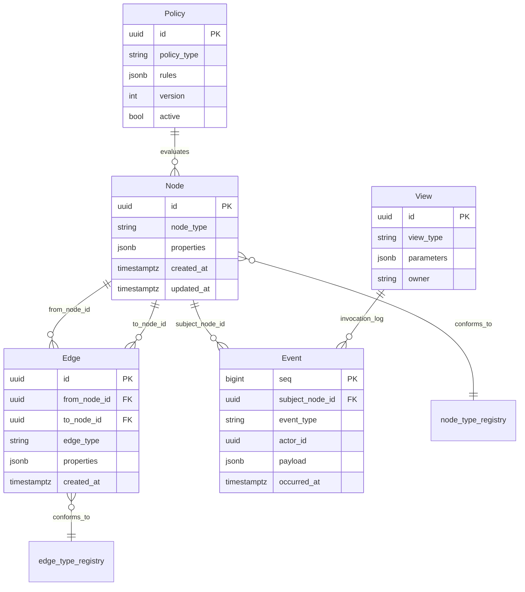

# 04. 数据设计 / Data Design

> **[PROPOSAL] IPA 共通框架 2013 章节定位：** P3.A1.T6 研讨数据模型 / P3.A2.T3 研讨数据构成


## 4.1 概念数据模型 / Conceptual Data Model

**[PROPOSAL]** 以 Phase 6 确定的 5 个原语作为概念数据模型的核心。Agent 是 Node 子类型。



## 4.2 物理 schema / Physical Schema（PostgreSQL）

仅列出主要表（实现时由 migration 文件细化）。

```sql
-- 5 原语核心
CREATE TABLE nodes (
    id              UUID PRIMARY KEY DEFAULT gen_random_uuid(),
    node_type       TEXT NOT NULL,
    properties      JSONB NOT NULL DEFAULT '{}',
    created_at      TIMESTAMPTZ NOT NULL DEFAULT now(),
    updated_at      TIMESTAMPTZ NOT NULL DEFAULT now(),
    -- Phase 13 修正案：图谱原生擦除用，逻辑删除标志
    deleted_at      TIMESTAMPTZ
);
CREATE INDEX idx_nodes_type ON nodes (node_type) WHERE deleted_at IS NULL;
CREATE INDEX idx_nodes_props_gin ON nodes USING GIN (properties);

CREATE TABLE edges (
    id              UUID PRIMARY KEY DEFAULT gen_random_uuid(),
    from_node_id    UUID NOT NULL REFERENCES nodes(id),
    to_node_id      UUID NOT NULL REFERENCES nodes(id),
    edge_type       TEXT NOT NULL,
    properties      JSONB NOT NULL DEFAULT '{}',
    created_at      TIMESTAMPTZ NOT NULL DEFAULT now()
);
CREATE INDEX idx_edges_from_type ON edges (from_node_id, edge_type);
CREATE INDEX idx_edges_to_type ON edges (to_node_id, edge_type);
-- Evidence 类型 Edge (GRF-REQ-010 修正案) 的约束
ALTER TABLE edges ADD CONSTRAINT chk_evidence_epistemic
    CHECK (edge_type <> 'evidence' OR (properties ? 'epistemic_status'
        AND properties->>'epistemic_status' IN ('verified','asserted','attested')));

-- 不可变事件日志 (兼作审计日志，采用 PostgreSQL 按月声明式范围分区)
CREATE TABLE events (
    id               UUID NOT NULL DEFAULT gen_random_uuid(),
    seq              BIGSERIAL,
    subject_node_id  UUID REFERENCES nodes(id),
    event_type       TEXT NOT NULL,
    actor_id         UUID,  -- Human or Agent Node id
    payload          JSONB NOT NULL DEFAULT '{}',
    occurred_at      TIMESTAMPTZ NOT NULL DEFAULT now(),
    PRIMARY KEY (id, occurred_at)
) PARTITION BY RANGE (occurred_at);

-- 按月分区模板（由 migration/自动化作业提前创建，如 events_y2026m08）
CREATE TABLE events_default PARTITION OF events DEFAULT;
CREATE INDEX idx_events_node_time ON events (subject_node_id, occurred_at);
CREATE INDEX idx_events_type_time ON events (event_type, occurred_at);
CREATE INDEX idx_events_seq ON events (seq);

-- Policy / View
CREATE TABLE policies (
    id              UUID PRIMARY KEY DEFAULT gen_random_uuid(),
    policy_type     TEXT NOT NULL,
    rules           JSONB NOT NULL,
    version         INT NOT NULL,
    active          BOOLEAN NOT NULL DEFAULT true
);

CREATE TABLE views (
    id              UUID PRIMARY KEY DEFAULT gen_random_uuid(),
    view_type       TEXT NOT NULL,
    parameters      JSONB NOT NULL,
    owner_id        UUID REFERENCES nodes(id)
);

-- 安全
CREATE TABLE users ( ... );  -- 认证信息 (hash 化)
CREATE TABLE roles ( ... );
CREATE TABLE permissions (
    subject_id   UUID,    -- Human or Agent Node id
    resource_id  UUID,    -- Node id
    action       TEXT,
    effect       TEXT CHECK (effect IN ('allow','deny'))
);
CREATE INDEX idx_perm_subject ON permissions (subject_id);

-- 密钥 (envelope encryption 完成)
CREATE TABLE secrets (
    id              UUID PRIMARY KEY DEFAULT gen_random_uuid(),
    owner_id        UUID NOT NULL REFERENCES nodes(id),
    encrypted_blob  BYTEA NOT NULL,
    dek_wrapped     BYTEA NOT NULL,  -- data encryption key, KMS wrap
    created_at      TIMESTAMPTZ NOT NULL DEFAULT now(),
    rotated_at      TIMESTAMPTZ
);
```

> **重要：** 根据 AISEC-REQ-009(a)，Platform 进程的常规读写用 DB 角色对 `events` 表**仅授权 INSERT**。`UPDATE` / `DELETE` 权限被独立到一个角色，Platform 启动时通过 migration 剥离。详见 [§7.2 审计](07-security-design.md#72-审计-audit) 末尾"对 Platform process 完全被攻陷的耐受性"小节。

## 4.3 图遍历 / Graph Traversal

**[PROPOSAL]** GRF-REQ-008 的查询 API 用递归 CTE 实现。深度限制作为函数必填参数（Phase 10 §1.2 的深度界限，应用 CTX-REQ-003 同等的预算管理）。针对复杂查询强制设置 2000ms 语句超时与最大 4 跳（硬上限 6 跳）约束以防雪崩：

```sql
-- 专用图查询会话强制设置语句级超时
SET LOCAL statement_timeout = '2000ms';

-- 例: 从 Issue 向下游 4 hop 取出所有 Node (Phase 9 DoD 第 9 步核心)
WITH RECURSIVE downstream AS (
    SELECT n.id, n.node_type, 1 AS depth
    FROM nodes n
    JOIN edges e ON e.from_node_id = n.id
    WHERE n.id = $1  -- 起点 Issue id
      AND e.edge_type IN ('motivated_by','blocks','implemented_by','assigned_to','reviewed_by','generated_by')
    UNION ALL
    SELECT n.id, n.node_type, d.depth + 1
    FROM nodes n
    JOIN edges e ON e.from_node_id = n.id
    JOIN downstream d ON e.to_node_id = d.id
    WHERE d.depth < $2  -- max_depth (默认 4，硬上限 6，防止环路耗尽连接池)
)
SELECT DISTINCT id, node_type FROM downstream;
```

## 4.4 Git 对象存储 / Git Object Storage

**[PROPOSAL]** Git 对象以裸仓库形式存储在文件系统。位置：`{data_dir}/git/{repo_id}.git/`。

| 项目 | 值 |
|---|---|
| 格式 | 裸 git 仓库（默认布局）|
| 位置 | `{data_dir}/git/{repo_id}.git/` |
| 备份 | 文件系统级 + PostgreSQL PITR 同时刻（BKP-REQ-001）|
| 所有权 | Platform 进程的运行用户 |
| 权限 | 0600 / 0700（OS 级别）|

## 4.5 数据生命周期 / Data Lifecycle

| 数据类型 | 创建 | 引用 | 更新 | 删除 / 归档 |
|---|---|---|---|---|
| Node | 图谱注册时 | 所有读操作 | 逻辑删除（设置 `deleted_at`）| 物理不删除（保留审计）※ GDPR 例外见 [§7.2](07-security-design.md#72-审计-audit) |
| Edge | 与 Node 同时 | 图查询 | 不可变（更正用 cancel Edge + 新 Edge）| 物理不删除 |
| Event | 所有状态变更时 | 审计 / View | 不可（仅追加）| 主库保留 6 个月热分区；超期分区归档至 S3 冷存储后 DETACH |
| Git 对象 | push 时 | 所有 Git 操作 | ref / object 追加 | 标准 `git gc`（V1）|
| Policy | 管理员操作 | Policy 评估时 | 新版本追加（旧版 `active=false`）| 物理不删除 |
| Secret | 必要时 | 凭据必要时 | 轮换（DEK 重新 wrap）| 物理删除（即时）|

## 4.6 数据所有权与可移植性 / Data Ownership & Portability（DATA-REQ）

- **DATA-REQ-001** 结构 diff 校验过的 round-trip 导出 / 导入
- **DATA-REQ-002** Git 对象可导出（V1：Phase 9 §2）
- **DATA-REQ-003** schema 与全数据的文档化导出
- **DATA-REQ-004** "无回拨"保证（V1：Phase 9 §2）
- **DATA-REQ-005** 导出时排除密钥（默认）

---

**导航 / Navigation:**
[← 03. 功能设计](03-functional-design.md) · [README](README.md) · [05. 接口设计概述 →](05-interface-design.md)
