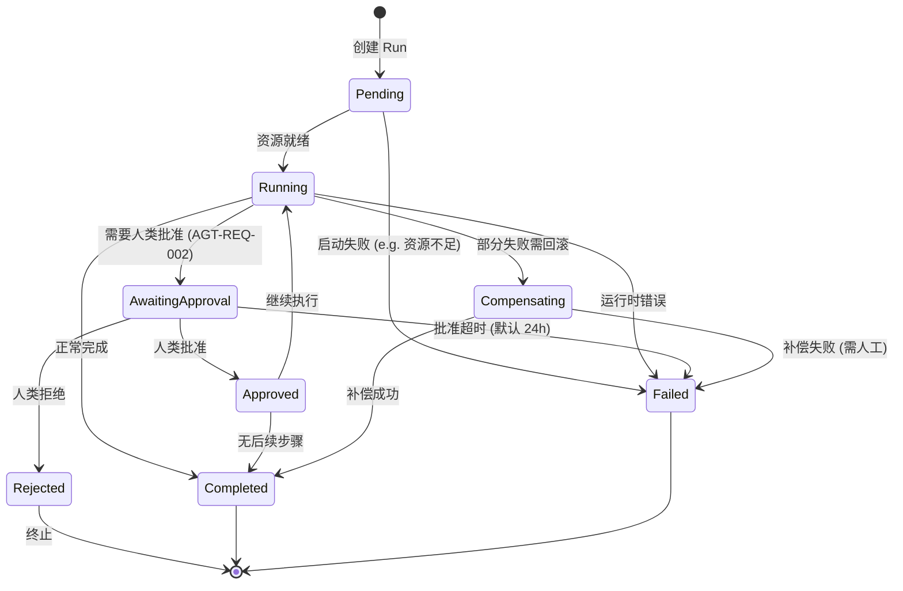

# Agent 状态机

> 详细设计：[`../04-agent-runtime.md`](../04-agent-runtime.md) §4.4 (状态机)
> 关联 REQ：AGT-REQ-001 (Agent 状态机)
> 关联流程：任务 62 (UT) / 83 (ST)

## 状态转移图

## 状态字段

`agent_runs.state` 字段值集合（与状态机对齐）：

| 状态 | 描述 | 终止？ |
|---|---|---|
| `pending` | 等待资源分配 | 否 |
| `running` | 实际执行中 | 否 |
| `awaiting_approval` | 等待人类批准 (AGT-REQ-002) | 否 |
| `approved` | 人类已批准 | 否 |
| `rejected` | 人类已拒绝 | 是 |
| `compensating` | 执行补偿 | 否 |
| `completed` | 正常完成 | 是 |
| `failed` | 失败 | 是 |

## 转移守卫条件

| 转移 | 守卫 |
|---|---|
| Pending → Running | 资源配额检查通过 |
| Running → AwaitingApproval | 检测到 AGT-REQ-002 标记的 action |
| AwaitingApproval → Approved | 人类批准 (signed JWT) |
| AwaitingApproval → Failed | `now() > started_at + human_approval_timeout_sec` |
| Running → Compensating | 事务失败 + 存在补偿步骤 |
