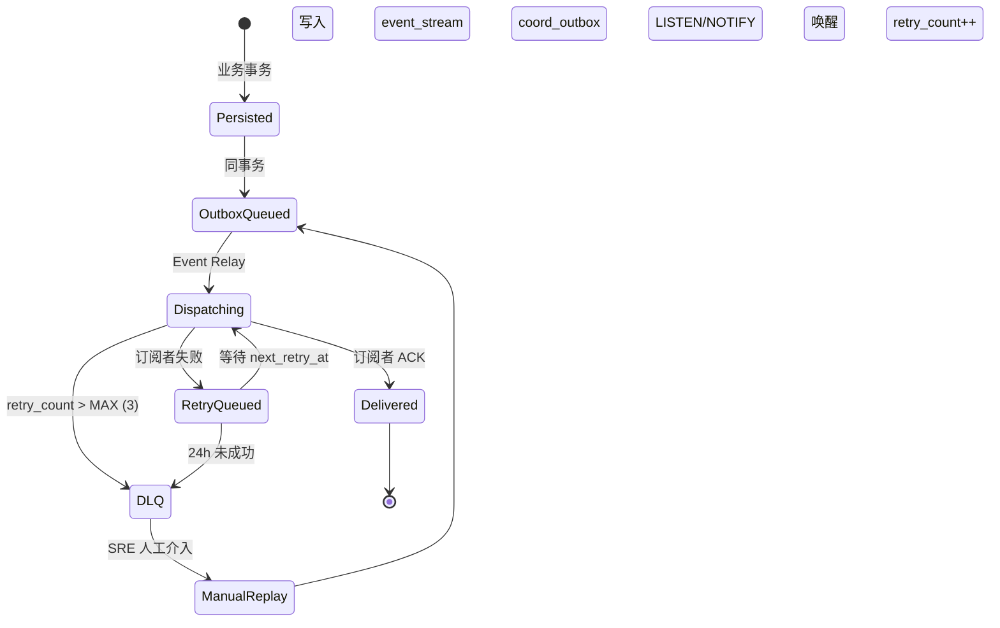
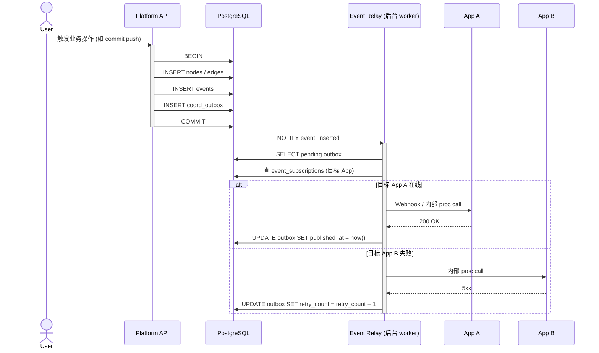

# 中心事件总线状态机

> 详细设计：[`../07-app-coordination.md`](../07-app-coordination.md) §7.4 (中心事件总线)
> 关联 REQ：APP-REQ-001/004 (中心事件) / AISEC-REQ-013 (App 沙箱)
> 关联流程：任务 67 (IT) / 83 (ST)

## 事件生命周期

## 时序图

## DLQ 触发条件

- `retry_count > 3` (MAX_RETRIES)
- 距首次发布 > 24h
- App 沙箱权限拒绝

## 状态字段

`coord_outbox.state` (隐式，由 published_at + retry_count 推算)：

| 状态 | 条件 |
|---|---|
| Pending | `published_at IS NULL AND retry_count = 0` |
| Dispatching | `published_at IS NULL AND retry_count > 0` |
| Delivered | `published_at IS NOT NULL` |
| DLQ | 已迁入 `event_dlq` 表 |
