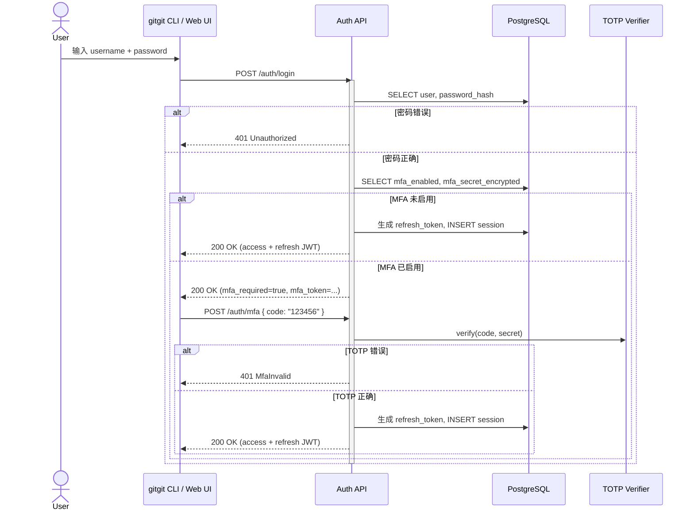
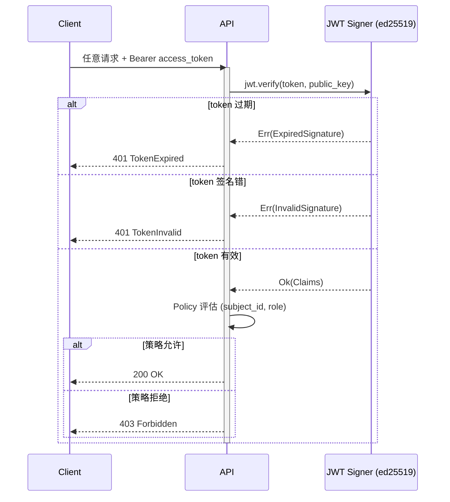

# 用户认证流程

> 详细设计：[`../09-security-impl.md`](../09-security-impl.md) §9.2 (JWT) / §9.3 (信封加密)
> 关联 REQ：SEC-REQ-001 (身份认证) / SEC-REQ-004 (短期凭证)
> 关联流程：任务 62 (UT) / 69 (ITa) / 83 (ST)

## 登录时序图（含 MFA）

## JWT 签发 / 验证

