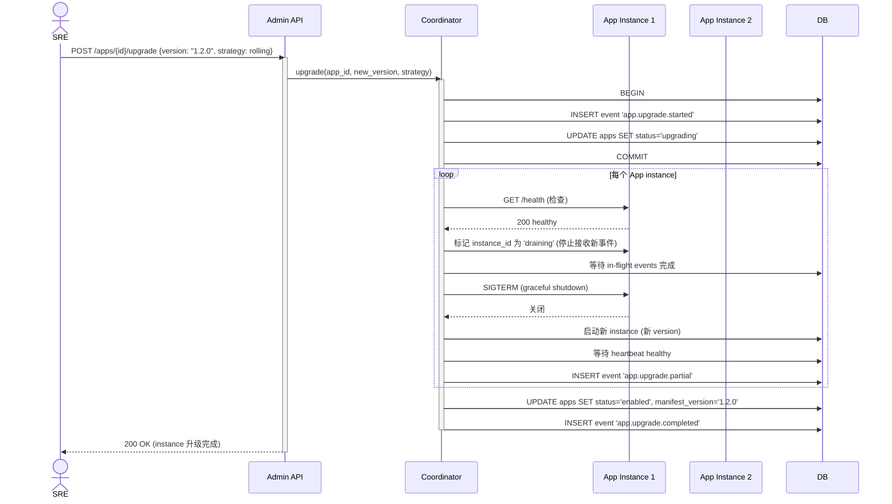

# App 升级流程

> 详细设计：[`../12-app-registry-and-plugin-loader.md`](../12-app-registry-and-plugin-loader.md) §12.7
> 关联 REQ：APP-REQ-007 (热插拔) / AISEC-REQ-013 (沙箱)
> 关联流程：任务 67 (IT) / 104 (生产环境) / 105 (生产部署)

## Rolling 升级时序图

## 回滚流程

升级失败 → 自动回滚：
- Coord 检测到新 instance 不健康（> 30s 未 heartbeat）
- 自动启动旧 version 的新 instance
- 删除新 instance
- 写 event `app.upgrade.rolled_back`
- 通知 SRE
